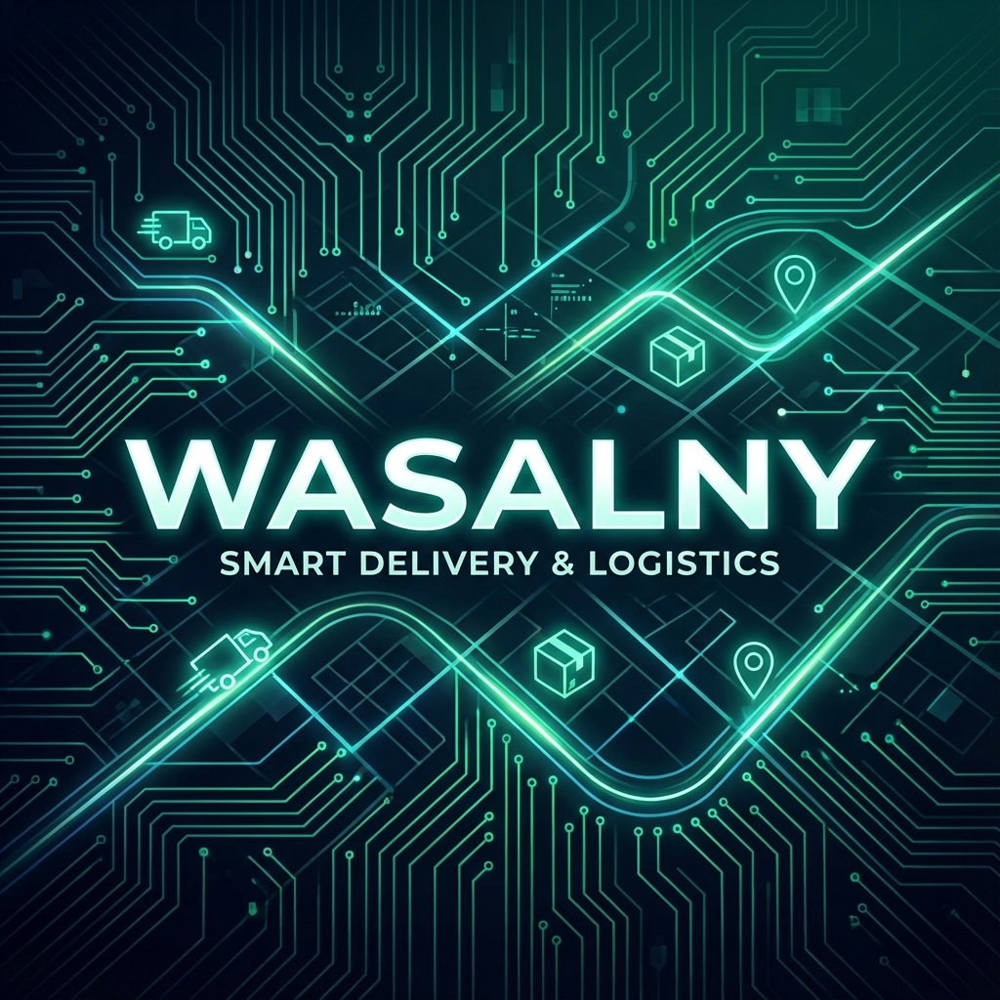

# Wasalny 🚚

[](https://github.com/dev-mustafa-hussin/build-your-app/actions/workflows/ci.yml)
[](https://www.gnu.org/licenses/agpl-3.0)

**Wasalny** is a comprehensive delivery and logistics application designed to streamline order management, driver coordination, and customer deliveries. It leverages interactive maps and a modern real-time architecture to ensure efficient operations.

[Live Demo](https://wasalny-six.vercel.app/)

## ✨ Features

- **User Authentication**: Secure sign-up and login for Admins, Merchants, and Drivers using Supabase Auth.
- **Interactive Maps**: Real-time visualization of orders, stores, and driver locations powered by Mapbox GL.
- **Order Management**: Complete lifecycle management of delivery orders from creation to completion.
- **Role-Based Dashboards**: Tailored views and functionalities for different user roles.
- **Store Owner Dashboard**: Manage products, orders, and store settings.
- **Modern UI/UX**: Built with Shadcn UI and Tailwind CSS for a sleek, responsive, and accessible interface.
- **Dark Mode Support**: Seamless toggle between light and dark themes.
- **PDF Export**: Generate invoices or reports directly from the application.

## 🛠️ Tech Stack

- **Frontend**: [React](https://react.dev/) with [Vite](https://vitejs.dev/)
- **Language**: [TypeScript](https://www.typescriptlang.org/)
- **Styling**: [Tailwind CSS](https://tailwindcss.com/)
- **UI Components**: [Shadcn UI](https://ui.shadcn.com/)
- **State Management**: [React Query](https://tanstack.com/query/latest) & React Context
- **Routing**: [React Router](https://reactrouter.com/)
- **Forms**: [React Hook Form](https://react-hook-form.com/) & [Zod](https://zod.dev/)
- **Backend & Database**: [Supabase](https://supabase.com/)
- **Maps**: [Mapbox GL JS](https://docs.mapbox.com/mapbox-gl-js/)

## 🚀 Getting Started

Follow these instructions to get a copy of the project up and running on your local machine.

### Prerequisites

- Node.js (v18 or higher recommended)
- npm or yarn

### Installation

1.  **Clone the repository**

    ```bash
    git clone https://github.com/dev-mustafa-hussin/build-your-app.git
    cd build-your-app
    ```

2.  **Install dependencies**

    ```bash
    npm install
    ```

3.  **Environment Setup**
    Create a `.env` file in the root directory and add your Supabase and Mapbox credentials:

    ```env
    VITE_SUPABASE_URL=your_supabase_url
    VITE_SUPABASE_ANON_KEY=your_supabase_anon_key
    VITE_MAPBOX_TOKEN=your_mapbox_access_token
    ```

4.  **Run the development server**

    ```bash
    npm run dev
    ```

5.  **Build for production**
    ```bash
    npm run build
    ```

## 📂 Project Structure

```
src/
├── components/   # Reusable UI components
├── contexts/     # React Context providers
├── hooks/        # Custom React hooks
├── integrations/ # Third-party integrations (Supabase, OpenAI, etc.)
├── lib/          # Utility functions and libraries
├── pages/        # Application pages/routes
└── App.tsx       # Main application component
```

## 🤝 Contributing

Contributions are welcome! Please feel free to submit a Pull Request.

1.  Fork the project
2.  Create your feature branch (`git checkout -b feature/AmazingFeature`)
3.  Commit your changes (`git commit -m 'Add some AmazingFeature'`)
4.  Push to the branch (`git push origin feature/AmazingFeature`)
5.  Open a Pull Request

## 📄 License

This project is licensed under the MIT License.
